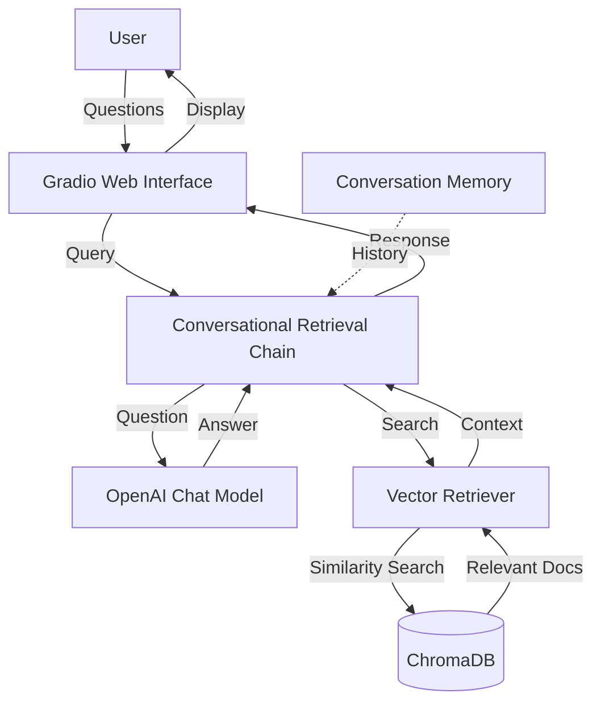
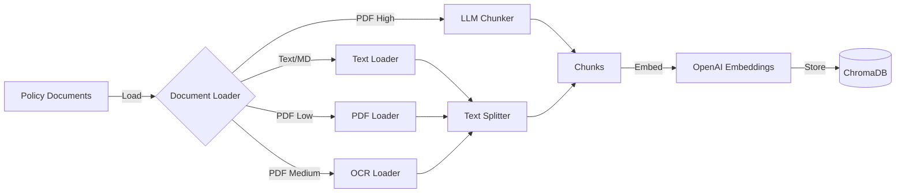

# Airline Policy Assistant Service

## Architecture Changes: From GPU-Dependent to CPU-Only Stack

> [!WARNING] Latest changes!
>
> Initially, this project relied on a GPU-dependent stack using libraries
> like `unstructured` for PDF processing and OCR. However, this approach
> introduced significant robustness issues:
>
> * **CUDA Dependency Problems**: `unstructured` required NVIDIA CUDA drivers
>   and GPU hardware. It failed in environments without compatible GPUs
>   (e.g., AMD/ATI GPUs, cloud instances without GPU allocation, or local
>   machines with driver issues).
> * **Inconsistent Performance**: Builds and runs were unreliable across
>   different architectures, leading to deployment failures.
> * **Complexity**: Managing GPU drivers and versions added unnecessary
>   overhead for a technical challenge focused on core functionality.
> * **Docker and Architecture Issues**: Building Docker images with GPU
>   dependencies was challenging and unreliable. Additionally, since the
>   final execution environment's architecture (GPU type or presence) was
>   unknown, we couldn't assume NVIDIA libraries or graphical capabilities.
>
> To address this, we switched to a **CPU-only stack** for maximum robustness
> and portability.
>
> We removed `unstructured` and replaced it with `pypdf` for
> PDF text extraction and `pytesseract` with `tesseract-ocr` for OCR:
>
> We also developed a custom PDF loader that processes documents page by page,
> integrating text extraction, OCR with image enhancement, and optional debugging
> for maximum control and accuracy.
>
> * **PDF Text Extraction**: Uses `pypdf` for direct text extraction from PDFs.
> * **OCR Processing**: Uses `pytesseract` with `tesseract-ocr` for image-based
>   text recognition, running entirely on CPU.
> * **No GPU Requirements**: Works on any machine, regardless of GPU type
>   (NVIDIA, AMD, or none).
> * **Docker Compatibility**: Docker images now work independently of the host
>   architecture, as the stack is CPU-only and doesn't require GPU-specific
>   drivers.
> * **OCR Debugging**: Optional debugging mode (via config) saves original
>   images, enhanced images, and extracted texts for inspection.
> * **OCR Improvements**: We studied and improved OCR processing techniques,
>   such as image enhancement for better text recognition.
>
> This change ensures the system runs reliably in any environment,
> prioritizing simplicity and compatibility over raw performance.
>
> For complex images, the existing LLM-based loader can always
> be used.
>
> ---

A Retrieval-Augmented Generation (RAG) chatbot application that allows users to
query airline policies using natural language. The system uses Large Language
Models (LLMs) for understanding questions and a vector database for efficient
document retrieval.

## Overview and Purpose

This application was developed as part of the Flight Center AI Center Of
Excellence technical challenge. It demonstrates the integration of LLMs with
vector databases to create an intelligent assistant that can answer questions
about airline policies from multiple carriers.

The system processes airline policy documents (PDF and Markdown), creates
embeddings, stores them in a ChromaDB vector database, and uses a conversational
AI interface powered by OpenAI's GPT models to answer user questions.

**Key Features:**

* Web-based chat interface using Gradio
* Support for multiple airlines (American Airlines, Delta, United)
* Advanced PDF processing with three levels: basic text extraction, OCR, and
  LLM-based chunking
* Conversational memory for context-aware responses
* Dockerized deployment with development and production modes

## Architecture and Folder Structure

```sh
ai_technical_challenge/
├── app/                       # Main application package
│   ├── __init__.py            # Package initialization
│   ├── __main__.py            # Entry point for the Gradio service
│   ├── config.py              # Configuration management
│   └── embeddings/            # Document processing and embedding logic
│       ├── __init__.py        # Package initialization
│       ├── embeddings.py      # Core embedding functions
│       ├── llm_chunker.py     # LLM-based document chunking
│       └── pdf_loader.py      # PDF loading and OCR processing
├── policies/                  # Airline policy documents
│   ├── AmericanAirlines/      # American Airlines policies (Markdown)
│   ├── Delta/                 # Delta Airlines policies (Markdown)
│   └── United/                # United Airlines policies (PDF)
├── tools/                     # Utility scripts
│   ├── API_test.py            # Test LLM API endpoint
│   ├── cleanup_chroma.py      # Clean vector database
│   ├── embed_company.py       # Embed documents for a company
│   ├── initialize.sh          # Initialize database with all policies
│   └── querier.py             # REPL-based query tool
├── dockers/                   # Standalone Docker configurations
│   ├── chromadb/              # ChromaDB standalone setup
│   └── portainer/             # Portainer management UI
├── docker-compose.yaml        # Development deployment
├── docker-compose-prod.yaml   # Production deployment
├── Dockerfile                 # Multi-stage Docker build
├── Pipfile                    # Python dependencies (Pipenv)
├── template.env               # Environment variable template
├── setup.cfg                  # Code quality tool configurations
└── ruff.toml                  # Ruff linter configuration
```

### System Architecture



### Data Processing Pipeline



## Getting Started

### Prerequisites

* Docker and Docker Compose
* Python 3.13 (if running locally without Docker)
* OpenAI API access

### Installation

1. **Clone the repository:**

   ```bash
   git clone https://github.com/Carbaz/ai_technical_challenge.git
   cd ai_technical_challenge
   ```

2. **Create environment configuration:**

   Copy the template and configure your environment variables:

   ```bash
   cp template.env .env
   ```

   Edit `.env` and set your API credentials:

   * `FCM_APA_LLM_API_URL`: Your LLM API base URL
   * `FCM_APA_LLM_API_KEY`: Your LLM API key

3. **Start the services:**

   For development mode with code mounting:

   ```bash
   docker-compose up
   ```

   For production mode:

   ```bash
   docker-compose -f docker-compose-prod.yaml up
   ```

4. **Initialize the database:**

   On first run, you need to populate the vector database with airline policies:

   ```bash
   docker-compose --profile reload up backend_init
   ```

   Or manually run the initialization script inside the container.

5. **Access the application:**

   Open your browser and navigate to:

   ```txt
   http://localhost:7860
   ```

## Usage Guide

### Running Locally with Standalone ChromaDB

If you prefer to run ChromaDB separately:

1. **Start ChromaDB:**

   ```bash
   cd dockers/chromadb
   docker-compose up -d
   ```

2. **Configure environment:**

   Set these variables in your `.env`:

   ```bash
   FCM_APA_CHROMADB_HOST=localhost
   FCM_APA_CHROMADB_PORT=8000
   ```

3. **Install Python dependencies:**

   ```bash
   pip install pipenv
   pipenv install
   ```

4. **Initialize the database:**

   ```bash
   pipenv run python -Bm tools.cleanup_chroma
   pipenv run python -Bm tools.embed_company -s policies/United -c United
   pipenv run python -Bm tools.embed_company -s policies/Delta -c Delta
   pipenv run python -Bm tools.embed_company -s policies/AmericanAirlines \
       -c AmericanAirlines
   ```

5. **Run the application:**

   ```bash
   pipenv run python -Bm app
   ```

### Running in Development Mode (Docker Compose)

Development mode mounts the source code into the container, allowing for
real-time code changes without rebuilding:

```bash
docker-compose up
```

**Features:**

* Source code mounted as volume (`./:/service`)
* Internal/external visibility of code changes
* Development dependencies installed
* Accessible at `http://localhost:7860`

### Running in Production Mode (Docker Compose Prod)

Production mode copies the code into the image for isolated deployment:

```bash
docker-compose -f docker-compose-prod.yaml up --build
```

**Features:**

* Code copied into image (not mounted)
* Optimized for deployment
* Only production dependencies
* Smaller image size
* Accessible at `http://localhost:7860`

### Database Initialization Profile

Both compose files include a `backend_init` service with the `reload` profile
for database initialization:

```bash
docker-compose --profile reload up backend_init
```

This service runs the `initialize.sh` script which:

1. Cleans the ChromaDB database
2. Processes and embeds all airline policies
3. Exits after completion

## Configuration

Configuration is managed through environment variables with the `FCM_APA_`
prefix. All variables can be set in the `.env` file.

### Available Configuration Options

| Variable | Default | Description |
|----------|---------|-------------|
| `FCM_APA_LOG_LEVEL` | `INFO` | Logging level (DEBUG, INFO, WARNING, ERROR) |
| `FCM_APA_LLM_API_URL` | None | Base URL for the LLM API |
| `FCM_APA_LLM_API_KEY` | None | API key for authentication |
| `FCM_APA_CHAT_MODEL` | `gpt-4.1-mini` | Model for chat interactions |
| `FCM_APA_CHUNKING_MODEL` | `gpt-5-mini` | Model for LLM-based chunking |
| `FCM_APA_EMBEDDING_MODEL` | `text-embedding-3-small` | Model for embeddings |
| `FCM_APA_OCR_DEBUG` | `false` | Enable OCR debugging mode to save images and texts |
| `FCM_APA_PDF_PROCESSING_LEVEL` | `MEDIUM` | PDF processing: LOW, MEDIUM, HIGH |
| `FCM_APA_CHROMADB_HOST` | `localhost` | ChromaDB hostname |
| `FCM_APA_CHROMADB_PORT` | `8000` | ChromaDB port |
| `FCM_APA_GRADIO_SERVER_NAME` | `0.0.0.0` | Gradio server bind address |
| `FCM_APA_GRADIO_HTTP_PORT` | `7860` | Gradio HTTP port |

### PDF Processing Levels

The application supports three levels of PDF processing:

* **LOW:** Basic text extraction without OCR
* **MEDIUM:** Advanced extraction with OCR for images (default)
* **HIGH:** LLM-based intelligent chunking and processing

**Example configuration:**

```bash
FCM_APA_PDF_PROCESSING_LEVEL=MEDIUM
```

## Main Dependencies

### Core Framework

* **Python 3.13:** Modern Python runtime with enhanced performance
* **Gradio:** Web UI framework for machine learning applications
* **LangChain:** Framework for building LLM applications
* **ChromaDB:** Vector database for embeddings

### LLM Integration

* **OpenAI:** Official OpenAI Python SDK for API access
* **langchain-openai:** LangChain integration for OpenAI models
* **langchain-chroma:** LangChain integration for ChromaDB

### Document Processing

* **pypdf**: PDF text extraction library
* **pytesseract**: Python wrapper for Tesseract OCR
* **tesseract-ocr**: OCR engine (system-level installation required)
* **RecursiveCharacterTextSplitter:** Intelligent document chunking

### Development Tools

* **Pipenv:** Dependency management and virtual environments
* **Ruff:** Fast Python linter
* **isort, mypy, pytest:** Code quality and testing tools

## Tools

The `tools/` directory contains utility scripts for managing the system:

### `embed_company.py`

Processes and embeds documents for a specific airline company.

**Usage:**

```bash
pipenv run python -Bm tools.embed_company \
    -s policies/Delta \
    -c Delta \
    -z 1000 \
    -o 100
```

**Arguments:**

* `-s, --sources`: Path to the policy documents directory
* `-c, --company`: Company name (metadata tag)
* `-z, --size`: Chunk size in characters (default: 1000)
* `-o, --overlap`: Chunk overlap in characters (default: 100)

### `cleanup_chroma.py`

Removes all embeddings from the ChromaDB database.

**Usage:**

```bash
pipenv run python -Bm tools.cleanup_chroma
```

### `querier.py`

REPL-based tool for testing similarity search directly against the vector
database.

**Usage:**

```bash
pipenv run python -Bm tools.querier
```

Allows interactive querying by company and displays retrieved document chunks.

### `initialize.sh`

Bash script that initializes the database with all airline policies.

**Usage:**

```bash
bash tools/initialize.sh
```

Executes in sequence:

1. Database cleanup
2. Embedding of United policies
3. Embedding of Delta policies
4. Embedding of American Airlines policies

### `API_test.py`

Tests connectivity and lists available models from the LLM API endpoint.

**Usage:**

```bash
pipenv run python -Bm tools.API_test
```

## Strategic Decisions

### Multi-Stage Docker Build

The Dockerfile uses a multi-stage build strategy:

* **Base stage:** Common dependencies (Python, CUDA libraries, Pipenv)
* **Init stage:** Includes policies for database initialization
* **Development stage:** Adds dev dependencies for local development
* **Production stage:** Minimal runtime-only image

**Rationale:** Reduces production image size while maintaining flexibility for
different deployment scenarios.

### ChromaDB as Vector Database

ChromaDB was chosen for its:

* Lightweight deployment
* Built-in filtering capabilities
* Seamless LangChain integration
* Docker-friendly architecture

### Three-Tier PDF Processing

Supports different processing strategies based on document complexity:

* **LOW:** Fast processing for text-based PDFs
* **MEDIUM:** OCR for scanned documents (balanced approach)
* **HIGH:** LLM-based semantic chunking for complex documents

**Rationale:** Allows optimization between processing time, cost, and quality
based on document characteristics.

### Conversational Memory

Uses `ConversationBufferMemory` to maintain chat history within the retrieval
chain.

**Rationale:** Enables context-aware follow-up questions without requiring
users to repeat context.

### Metadata-Based Company Filtering

Each document chunk includes company metadata, enabling filtered similarity
search.

**Rationale:** Ensures responses draw from the correct airline's policies,
preventing cross-contamination of information.

### Configuration via Environment Variables

All configuration through the `environs` library with the `FCM_APA_` prefix.

**Rationale:** Follows the 12-factor app methodology, enabling easy
containerization and deployment across environments.

## Usage Examples

### Example Questions

Here are real-world queries the system can answer:

**Query:**

```txt
Can my pet travel with me on the plane on Delta?
```

**Response Type:** Information about Delta's pet policies, including cabin
restrictions, carrier requirements, and fees.

---

**Query:**

```txt
I have three kids 2, 8 and 10 years old and I am traveling with them on a
United flight, what are the rules for children traveling?
```

**Response Type:** Details about United's policies for traveling with children,
including infant requirements, unaccompanied minor rules, and family boarding.

---

**Query:**

```txt
What is the baggage policy for American Airlines?
```

**Response Type:** Comprehensive baggage information including size limits,
weight restrictions, and fees.

---

**Query:**

```txt
My wife is 8 months pregnant, can she travel on a Delta flight?
```

**Response Type:** Delta's policies on pregnant passengers, including
restrictions and medical documentation requirements.

---

### Code Example: Embedding Workflow

From `embeddings.py`:

```python
def embed_directory(directory, metadata, model_name,
                    chunk_size, chunk_overlap, db_host, db_port):
    """Embed documents from directory."""
    # Process text and Markdown documents.
    text_chunks = chunk_directory_text(directory, chunk_size, chunk_overlap)
    # Process PDF documents.
    pdf_chunks = chunk_directory_pdf(directory, chunk_size, chunk_overlap)
    # Combine all chunks.
    chunks = text_chunks + pdf_chunks
    if not chunks:
        _logger.info(f'NO DOCUMENTS FOUND AT "{directory}"')
        return
    # Update metadata and embed all chunks.
    _logger.info(f'UPDATING METADATA')
    chunks = update_metadata(chunks, metadata)
    embedding_model = OpenAIEmbeddings(model=model_name,
                                       api_key=LLM_API_KEY,
                                       base_url=LLM_API_URL)
    _logger.info(f'EMBEDDING DOCUMENTS')
    embed_documents(chunks, embedding_model, db_host, db_port)
```

### Code Example: Chat Interface

From `__main__.py`:

```python
# Set up the conversation chain with the Chat LLM, the vectorstore and the
# memory.
conversation_chain = ConversationalRetrievalChain.from_llm(
    llm=llm,
    retriever=retriever,
    memory=memory)


# Chat function for Gradio interface.
# * "history" isn't used as the memory is included on the
#   ConversationalRetrievalChain.
def _chat(message, history):
    result = conversation_chain.invoke({"question": message})
    return result["answer"]


try:
    view = gr.ChatInterface(_chat, type="messages").launch(
        server_name=GRADIO_SERVER_NAME, server_port=GRADIO_HTTP_PORT)
except Exception as ex:
    _logger.critical(f'CRITICAL ERROR ON GRADIO SERVICE: {ex}')
    exit(1)
```

## Screenshots


## Referenced Files

The following project files were used as reference to generate this
documentation:

* `ai_technical_challenge/CHALLENGE.md`
* `ai_technical_challenge/Pipfile`
* `ai_technical_challenge/Dockerfile`
* `ai_technical_challenge/docker-compose.yaml`
* `ai_technical_challenge/docker-compose-prod.yaml`
* `ai_technical_challenge/template.env`
* `ai_technical_challenge/setup.cfg`
* `ai_technical_challenge/ruff.toml`
* `ai_technical_challenge/app/__main__.py`
* `ai_technical_challenge/app/config.py`
* `ai_technical_challenge/app/embeddings/embeddings.py`
* `ai_technical_challenge/app/embeddings/llm_chunker.py`
* `ai_technical_challenge/app/embeddings/pdf_loader.py`
* `ai_technical_challenge/tools/embed_company.py`
* `ai_technical_challenge/tools/cleanup_chroma.py`
* `ai_technical_challenge/tools/querier.py`
* `ai_technical_challenge/tools/initialize.sh`
* `ai_technical_challenge/tools/API_test.py`

## Limitations and Future Improvements

### Known Limitations

* **Single-collection ChromaDB:** All companies share one collection with
  metadata filtering. Multiple collections could improve isolation.
* **In-memory conversation history:** Memory resets when the service restarts.
  Persistent storage would enable session recovery.
* **Deprecated conversational chain:** `ConversationalRetrievalChain` is deprecated and
  should be migrated to use `create_history_aware_retriever` together with
  `create_retrieval_chain` instead:
  * <https://python.langchain.com/api_reference/langchain/chains/langchain.chains.conversational_retrieval.base.ConversationalRetrievalChain.html>
* **No authentication:** The Gradio interface is publicly accessible without
  user authentication.
* **Limited error handling for API failures:** Network issues or API rate limits
  may cause ungraceful failures.
* **Fixed chunk parameters:** Chunk size and overlap are configured per
  embedding run, not optimized per document type.
* **OCR accuracy:** OCR accuracy may vary with complex images;
  use LLM loader for better results.

### Future Improvements

* **Separate Loader and Chat services:** Separate services will allow a much more
  manageable Loader without overloading the service or project repository.
* **Multi-user support:** Add session management and user authentication
* **Persistent conversation history:** Store users chat history in a database
* **Citation support:** Display source document references with answers
* **Advanced RAG techniques:** Implement hybrid search (keyword + semantic),
  re-ranking, or query expansion
* **Monitoring and observability:** Add metrics, logging aggregation, and
  performance monitoring
* **API endpoint:** Expose a REST API alongside the Gradio interface
* **Document versioning:** Track policy document updates and version history
* **Optimize OCR preprocessing:** For specific document types.
